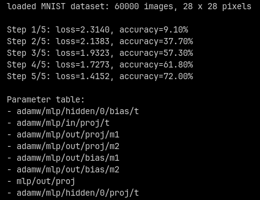

**Tiny NN is a deep learning framework written from scratch in C.**

> [!NOTE]
> Currently a work in progress. Future features are planned, including:
>
> - More tensor operations
> - Advanced model examples
> - CPU backend optimizations
> - Alternative Vulkan compute backend

### MNIST classifier example in action



### API example

```c
#include <tnn/tnn.h>

// MODEL DEFINITION
// - Just a regular function!
// - Scope uniquely identifies parameters, even with dynamic control flow
// - No __init__()/forward() repetition thanks to lazy initialization

tnn_tensor_t *mlp(tnn_tensor_t *input, size_t dim_out, size_t dim_hidden, size_t num_hidden) {
	TNN_SCOPE("mlp") {
		TNN_SCOPE("in") {
			input = tnn_relu(tnn_bias(tnn_proj(input, dim_hidden)));
            // tnn_proj weights stored under "mlp/in/proj"
		}
		TNN_SCOPE("hidden") {
			for (size_t i = 0; i < num_hidden; i++) {
				TNN_SCOPE("%zu", i) {
					input = tnn_relu(tnn_bias(tnn_proj(input, dim_hidden)));
                    // tnn_proj weights stored under "mlp/hidden/{i}/proj"
				}
			}
		}
		TNN_SCOPE("out") {
			input = tnn_bias(tnn_proj(input, dim_out));
		}
	}
	return input;
}

// TRAINING LOOP

int main() {
    if (tnn_init()) {
        return 1;
    }
    // Load existing model or checkpoint:
    // tnn_load("mnist.tnn");

    for (int i = 0; i < 100; i++) {
        tnn_tensor_t *x, *y; // TNN_INPUT
        // ... load x, y from dataset ...

        tnn_tensor_t *y_pred = mlp(x, 10, 128, 2); // TNN_OUTPUT
        tnn_tensor_t *loss = tnn_cross_entropy(y_pred, y); // TNN_OUTPUT

        tnn_zero_grad();
        tnn_backward(loss);
        tnn_adamw(TNN_ADAMW_CFG());
        // tnn_adamw creates "adamw/..." scope for optimizer buffers

        printf("\nloss: ");
        tnn_print(loss);

        // Remember to free the computation graph!
        tnn_free(loss, TNN_INPUT | TNN_OUTPUT);
    }

    // Strip optimizer if not checkpointing:
    tnn_drop("adamw");

    tnn_save("mlp.tnn");
    tnn_terminate();
    return 0;
}
```
